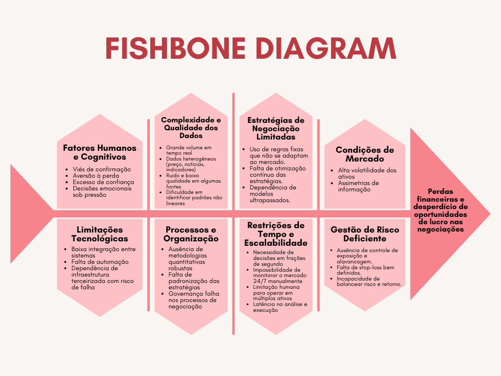

# Visão de Produto

## Introdução

Em um cenário de mercados financeiros cada vez mais dinâmicos e complexos, a tomada de decisão baseada apenas na análise humana se torna limitada. A velocidade com que preços, volumes de negociação e notícias mudam exige sistemas capazes de processar grandes quantidades de dados em tempo real e responder de forma precisa e consistente. Nesse contexto, a aplicação de técnicas de Machine Learning surge como uma solução estratégica para reduzir vieses humanos, acelerar análises e apoiar decisões mais eficazes.

Este projeto propõe o desenvolvimento de um Agente de Negociação Automatizada (Trading Bot), cujo objetivo é prever o comportamento futuro de ativos financeiros, como ações ou criptomoedas, e utilizar essas previsões para executar negociações de forma autônoma. Mais do que a simples construção de um modelo preditivo, o foco está na implementação de um sistema completo de aprendizado de máquina aplicado a séries temporais, integrando coleta de dados, previsão, simulação de negociações e avaliação de desempenho.

## O Problema

Com o intuito de compreender de maneira sistemática os fatores que contribuem para perdas financeiras e para o desperdício de oportunidades de lucro nas negociações, elaborou-se um Diagrama de Ishikawa (Fishbone Diagram), como é possível ver na Figura 1. Tal ferramenta permite estruturar visualmente as múltiplas causas do problema, distribuindo-as em categorias que evidenciam a complexidade e a interdependência entre variáveis humanas, tecnológicas, organizacionais e de mercado.

Entre as principais dimensões identificadas, destacam-se:

- **Fatores Humanos e Cognitivos**: vieses psicológicos, excesso de confiança e decisões influenciadas por emoções comprometem a racionalidade do processo decisório.
- **Complexidade e Qualidade dos Dados**: o grande volume de informações, associado à heterogeneidade e à presença de ruídos, dificulta a extração de padrões relevantes para subsidiar estratégias de negociação.
- **Estratégias de Negociação Limitadas**: a adoção de regras fixas, a ausência de mecanismos de atualização contínua e a utilização de modelos defasados reduzem a capacidade adaptativa frente às dinâmicas de mercado.
- **Condições de Mercado**: a volatilidade elevada e a assimetria de informação colocam os investidores em situação de desvantagem, sobretudo quando comparados a agentes institucionais de maior porte.
- **Limitações Tecnológicas**: falhas de integração entre sistemas, ausência de automação e dependência de infraestrutura terceirizada contribuem para atrasos, inconsistências e riscos operacionais.
- **Processos e Organização**: a inexistência de metodologias robustas, de padronização de procedimentos e de mecanismos de governança prejudica a consistência das práticas de negociação.
- **Restrições de Tempo e Escalabilidade**: a necessidade de decisões em escalas de tempo reduzidas (milissegundos) e a impossibilidade de monitoramento ininterrupto do mercado evidenciam a ineficiência das estratégias manuais.
- **Gestão de Risco Deficiente**: a ausência de controles adequados de exposição, o uso inadequado de instrumentos de proteção (como stop-loss) e a falta de equilíbrio entre risco e retorno ampliam a probabilidade de perdas significativas.

A partir desse mapeamento, observa-se que as perdas financeiras não são decorrentes exclusivamente da dificuldade de prever preços, mas resultam de um conjunto multifatorial de limitações, distribuídas em diferentes esferas de influência.

    
    
<b>Figura 1:</b> Diagrama de Ishikawa

----

<b>Histórico de Revisão</b>

|Data|Versão|Descrição|Autores|
|-|-|-|-|
|23/09/2025|0.1|Adição da documentação inicial|Júlia Yoshida, Jefferson Sena e Tiago Albuquerque|

